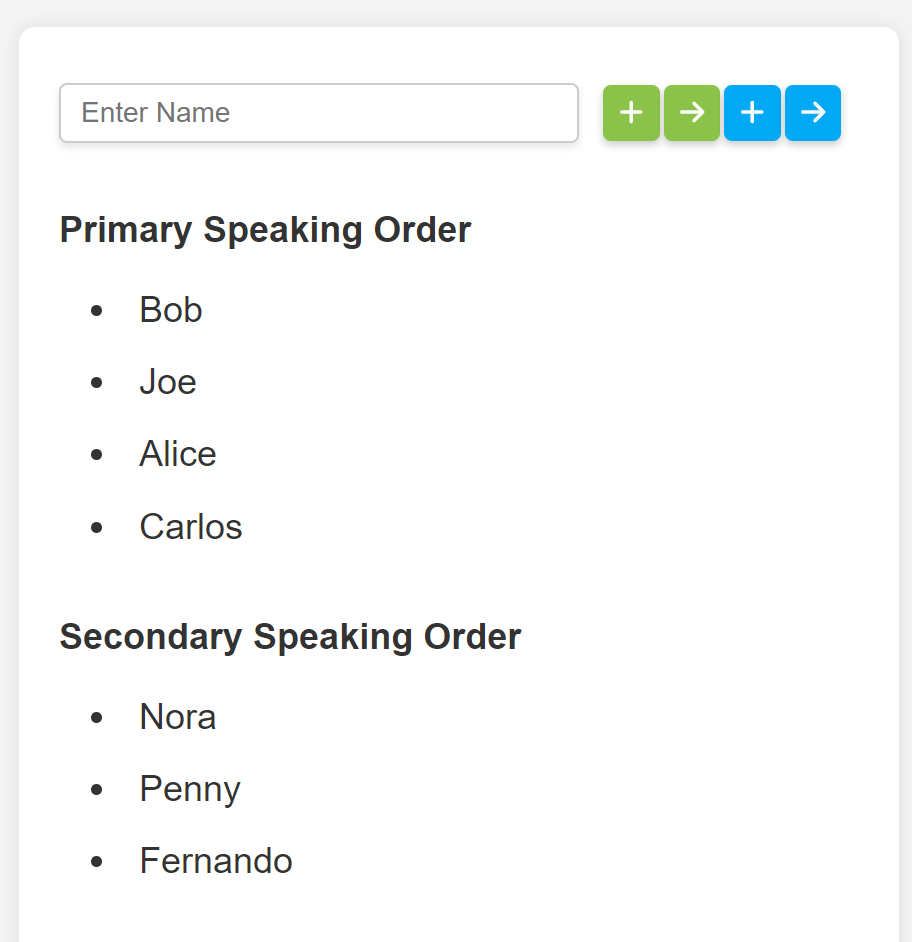
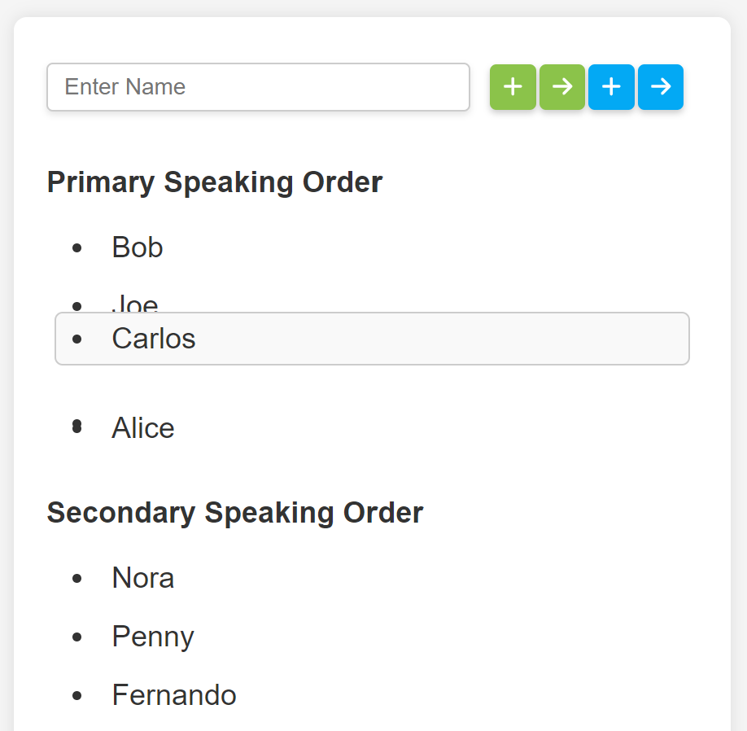

# Minimalistic Speaking Order Management
Basic webpage to facilitate maintenance of a primary speaking order and secondary speaking order for deliberative events.

Enter a name in the textbox, and press  button to add to bottom of Primary Speaking Order, and press  button to add to bottom of Secondary Speaking Order.

To remove the next speaker from top of each order, click the  button for removing from primary and click the  button for removing from secondary.

To rearrange entries in each speaking order, simply drag the desired entry and drop it in its new location.

## Running Locally
Running the page locally requires Node.js v14+ and the [serve](https://www.npmjs.com/package/serve) package. Once installed,
first build the webapp using `npm run build`.  
Next, navigate into the build directory and run `serve -s -l ${PORT}`, where PORT is the port to host the app on. If not specified, this defaults to port 3000.

## Acknowledgements
- This project was bootstrapped with [Create React App](https://github.com/facebook/create-react-app).
- This project uses [@hello-pangea/dnd](https://github.com/hello-pangea/dnd) to support queue reordering with drag and drop.